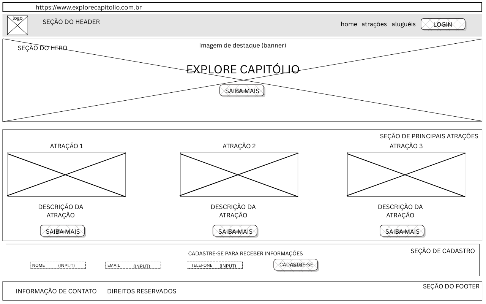

# Trabalho Prático - Semana 03

Dessa vez, vamos escolher uma proposta de projeto para trabalhar.

Nessa atividade, você deverá montar a página inicial do projeto escolhido, a organização do HTML aplicando semântica correta e uso aprimorado do CSS. Leia o enunciado completo no Canvas para mais detalhes.

**IMPORTANTE:** Você deve trabalhar e alterar apenas arquivos dentro da pasta **`public`**. Deixe todos os demais arquivos e pastas desse repositório inalterados. **PRESTE MUITA ATENÇÃO NISSO.**

## Informações Gerais

- Nome:Ulisses
- Matricula:901839
- Proposta de projeto escolhida:
A proposta escolhida foi “Lugares e Experiências”, com foco na cidade de Capitólio MG, conhecida como um dos principais destinos turísticos de Minas gerais
- Breve descrição sobre seu projeto:
Irei criar um site informativo da cidade de Capitólio MG, nde mostra aluguéis de casa, eventos na cidade, alugéis de lancha, melhores preços e etc.
A ideia central é criar uma home page interativa e informativa, que apresente as principais atrações, passeios e experiências
disponíveis na região, servindo como um guia rápido para visitantes.
A home page será organizada com uma estrutura semântica e visual agradável, contendo:
Banner de destaque com chamada principal para explorar Capitólio.
Seção com as principais atrações turísticas (ex.: Cânions de Furnas, Mirante dos Cânions, Cachoeiras), cada uma acompanhada de imagem
título, descrição e link para mais detalhes.
Formulário para inscrição em uma lista de informações e novidades.
Rodapé com informações básicas sobre o site e contatos.

## Print do(s) wireframe(s) criado

## Print da home-page criada

<<  COLOQUE A IMAGEM AQUI >>
